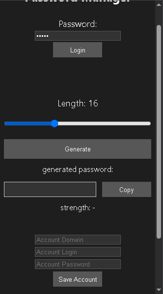
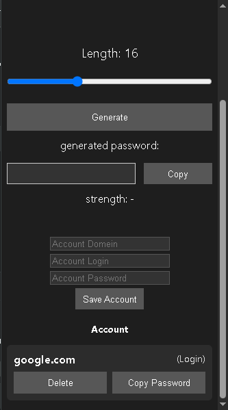

# 🔐 Password Manager – Chrome Extension

A private and secure password manager built as a Chrome extension.  
This project was developed for the course **"Data Protection / Information Security"** (`ZDW`) and for personal use and learning purposes.

---

## 📌 Features

- 🔒 **Master Password** authentication
- 🧠 **AES-GCM encryption** using Web Crypto API
- 🔑 **Password generator** with strength estimation (`zxcvbn`)
- 📋 **One-click copy to clipboard**
- 🌒 **Dark mode support** (via `prefers-color-scheme`)
- 🚫 **Protected access** – data is hidden until master key is verified
- 💡 Simple, clean and responsive interface

---

## 🖼️ Screenshot





---

## 🚀 Installation (Developer Mode)

1. Clone the repository or download ZIP:
   ```bash
   git clone https://github.com/Matsunaru/PasswordManager.git
   ```
2. Open `chrome://extensions/` in your browser.
3. Enable **Developer Mode**.
4. Click **"Load unpacked"** and select the project folder.
5. You're ready to go 🎉

---

## 🔐 Security Design

- Passwords are encrypted using `AES-GCM` (Web Crypto API).
- The master password is **never stored** anywhere.
- All data is kept **locally** using `chrome.storage.local`.
- Decryption only happens after successful login with master key.
- Passwords are **not exposed to the DOM** unless explicitly requested (e.g., copied to clipboard).

---

## 🗂️ Project Structure

```
password/
├── manifest.json
├── popup.html
├── popup.js
├── popup.css
├── zxcvbn.js
└── icons/
```

---

## 📚 Future Ideas / TODO

- [ ] Export & import account data (JSON)
- [ ] "Log out" button
- [ ] Auto-lock after timeout
- [ ] Account search filter
- [ ] Better visual icons (delete/copy)
- [ ] Optional cloud sync

---

## 🧑‍💻 Author

Created by **Matsunaru**  

---
